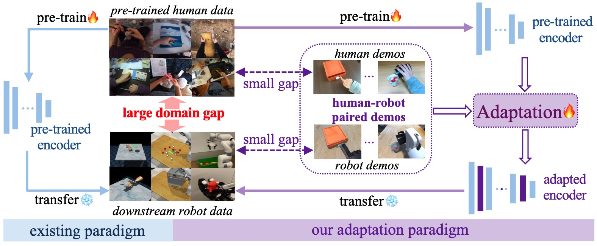

# [CVPR 2025] Mitigating the Human-Robot Domain Discrepancy in Visual Pre-training for Robotic Manipulation

#### 🤖[[Project Page]](https://jiaming-zhou.github.io/projects/HumanRobotAlign/) 📑[[Paper]](https://arxiv.org/abs/2406.14235)  🤗[[huggingface]](https://huggingface.co/Jiaming2472/HumanRobotAlign/tree/main)

[Jiaming Zhou](https://jiaming-zhou.github.io/)<sup>1</sup>, Teli Ma<sup>1</sup>, Kun-Yu Lin<sup>2</sup>, Zifan Wang<sup>1</sup>, Ronghe Qiu<sup>1</sup>, [Junwei Liang](https://junweiliang.me/)<sup>1,3</sup>

<sup>1</sup>AI Thrust, HKUST (Guangzhou), <sup>2</sup>Sun Yat-sen University, <sup>3</sup>HKUST


## Overview
This is the official repo for [HumanRobotAlign](https://jiaming-zhou.github.io/projects/HumanRobotAlign/), which proposes a novel adaptation paradigm that leverages readily available paired human-robot video data to bridge the domain gap between human-data pre-trained models and downstream robotic manipulation tasks.



Our adaptation paradigm includes two stages. 
- The first adaptation stage adapts existing human-data pre-trained models using semantics-aligned human-robot video pairs.
- The second evaluation stage evaluates the adapted models on downstream manipulation benchmarks. The evaluation includes downstream-training part and downstream-test part. The downstream-training part utilizes the adapted pre-trained models as fronzen backbones for policy learning. And the downstream-test part tests the learned policies.


If you find this useful, please cite the paper!
```bibtex
@article{zhou2024mitigating,
  title={Mitigating the human-robot domain discrepancy in visual pre-training for robotic manipulation},
  author={Zhou, Jiaming and Ma, Teli and Lin, Kun-Yu and Wang, Zifan and Qiu, Ronghe and Liang, Junwei},
  journal={arXiv preprint arXiv:2406.14235},
  year={2024}
}
```


# Evaluation Stage on RLBench Benchmark.
## Installation
### 1. Clone this repo
`git clone git@github.com:jiaming-zhou/HumanRobotAlign.git`
### 2. Install conda environment and simulator
Following the [RVT](https://github.com/NVlabs/RVT) to install conda environment and CoppeliaSim.
### 3. Install RVT, PyRep, RLBench, YARR and PerAct Colab
```
cd HumanRobotAlign
pip install -e .
pip install -e rvt/libs/PyRep 
pip install -e rvt/libs/RLBench 
pip install -e rvt/libs/YARR 
pip install -e rvt/libs/peract_colab
``` 

### Training Downstream Policies

#### Download the [RLBench Replay data for training](https://huggingface.co/datasets/ankgoyal/rvt/tree/main/replay) provided by [RVT](https://github.com/NVlabs/RVT).
Set the value of TRAIN_REPLAY_STORAGE_DIR in "rvt/train.py" to the rlbench replay data path.

#### [UnadaptedR3M2RLBench]: using [R3M's pre-trained model](https://arxiv.org/abs/2203.12601) as frozen backbone to train policy on RLBench:
   
- download R3M's pre-trained model ([UnadaptedR3M.pt](https://huggingface.co/Jiaming2472/HumanRobotAlign/blob/main/UnadaptedR3M.pt)) and put it under subfolder 'pretrains';
- then run the following command:
  ```
  cd rvt
  python train.py --exp_cfg_path configs/unadaptedR3M.yaml --device [gpu_ids]
  ``` 

#### [AdaptedR3M2RLBench]: using our adapted R3M model as frozen backbone to train policy on RLBench:
   
- download our adapted R3M model ([AdaptedR3M.pyth](https://huggingface.co/Jiaming2472/HumanRobotAlign/blob/main/AdaptedR3M.pyth)) and put it under subfolder 'pretrains';
- then run the following command:
  ```
  cd rvt
  python train.py --exp_cfg_path configs/adaptedR3M.yaml --device [gpu_ids]
  ``` 


### Test Downstream Policies
#### Download the [RLBench Test data for testing](https://drive.google.com/drive/folders/0B2LlLwoO3nfZfkFqMEhXWkxBdjJNNndGYl9uUDQwS1pfNkNHSzFDNGwzd1NnTmlpZXR1bVE?resourcekey=0-jRw5RaXEYRLe2W6aNrNFEQ&usp=share_link) by following [PerAct](https://github.com/peract/peract#download) repo.

#### Test [UnadaptedR3M2RLBench]:
- download our trained [UnadaptedR3M2RLBench](https://huggingface.co/Jiaming2472/HumanRobotAlign/blob/main/UnadaptedR3M2RLBench.tar) policy and unzip it under the subfolder 'rvt/runs', or use the policy trained by yourself;
- then run the following command:
  ```
  cd rvt
  xvfb-run -a python eval.py --model-folder runs/UnadaptedR3M2RLBench --eval-datafolder /your_data_path/RLBench/test --tasks all --eval-episodes 25 --log-name your_logname --device 0 --headless --model-name model_4.pth
  ```

#### Test [adaptedR3M2RLBench]:
- download our trained [AdaptedR3M2RLBench](https://huggingface.co/Jiaming2472/HumanRobotAlign/blob/main/AdaptedR3M2RLBench.tar) policy and unzip it under the subfolder 'rvt/runs', or use the policy trained by yourself;
- then run the following command:
  ```
  cd rvt
  xvfb-run -a python eval.py --model-folder runs/AdaptedR3M2RLBench --eval-datafolder /your_data_path/RLBench/test --tasks all --eval-episodes 25 --log-name your_logname --device 0 --headless --model-name model_4.pth
  ```


## Acknowledgments
[RLBench](https://sites.google.com/view/rlbench), [PerAct](https://github.com/peract/peract#download), [RVT](https://github.com/NVlabs/RVT).

## Bibtex
If you find this useful, please cite the paper!
```bibtex
@article{zhou2024mitigating,
  title={Mitigating the human-robot domain discrepancy in visual pre-training for robotic manipulation},
  author={Zhou, Jiaming and Ma, Teli and Lin, Kun-Yu and Wang, Zifan and Qiu, Ronghe and Liang, Junwei},
  journal={arXiv preprint arXiv:2406.14235},
  year={2024}
}
```
